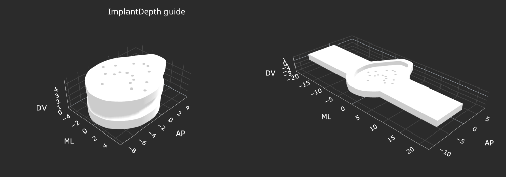
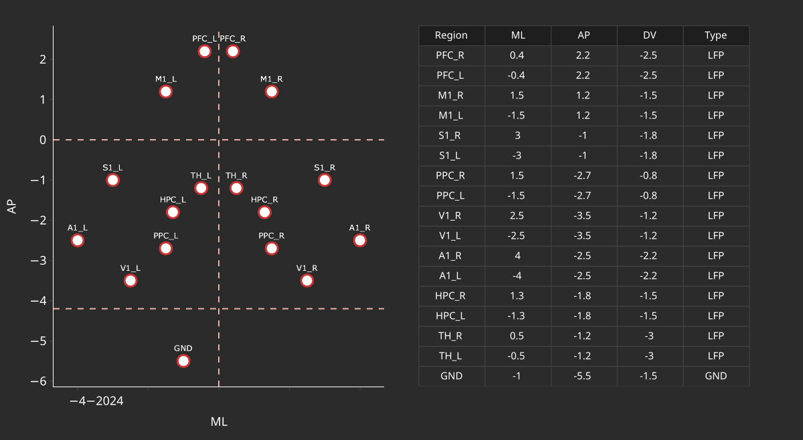
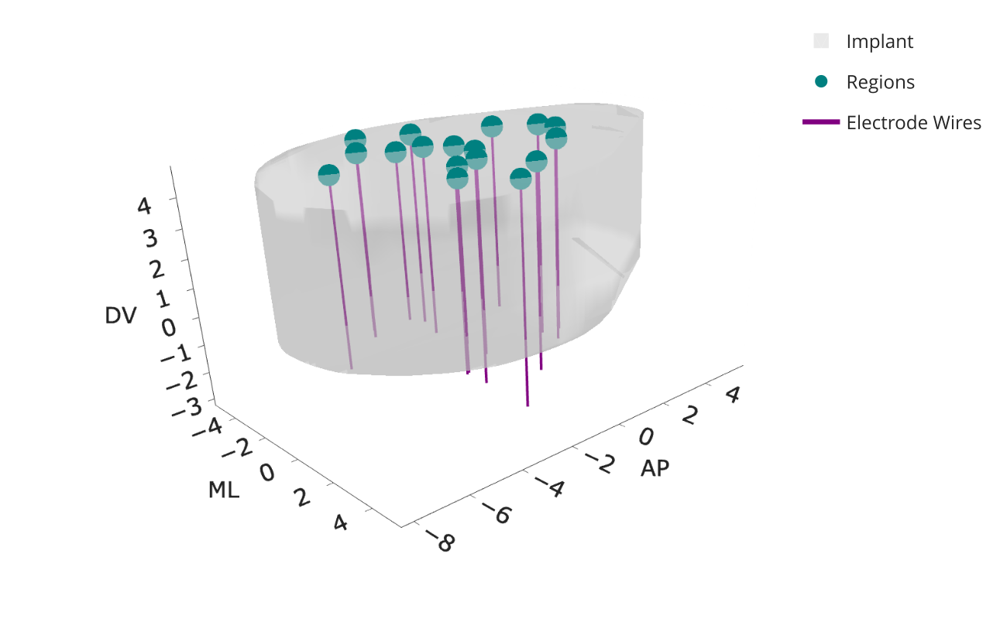
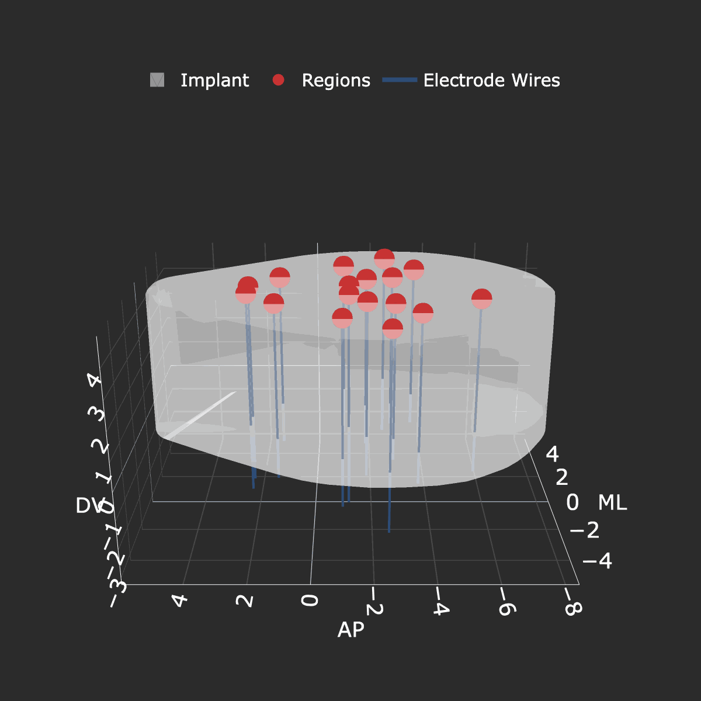
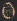
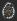
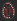
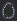

# NightCap

> ### NightCap is a tool for constructing custom electrophysiology implants for performing multi-site electrophysiology. Given a set of stereotaxic coordinates for up to 16 brain regions, this pipeline will produce a 3D-printable implant along with a custom electrode interface board (EIB) where holes in both are stereotaxically defined.

#### *Note: NightCap was made initially for performing long-term electrophysiology for sleep studies; however, this tool can be applied as readily to any chronic electrophysiology setup.*
***

## *Procedure*
### *General Overview*

> 1.  First, create a CSV file of stereotaxic locations with the following columns: `['Region', 'AP', 'ML', 'DV', 'Type']`.
> 1. Type should be one of `['LFP', 'GND', 'REF', 'EEG', 'EMG']`.
> 1. Save this file to the `StereotaxCoords` folder.
> 1. Proceed to `Implant` instructions below to construct the 3D-printable implant.
> 1. Proceed to `PCB`, `Bottom PCB`, and `Top PCB` instructions to construct the bottom and top PCBs.
> 1. Proceed to `Assembly` to put everything together. 
> *Note: Images below are examples from running the pipeline on the CSV provided in the repo: `./StereotaxCoords/CTX_TH_HPC_Bilateral_16Ch.csv`*

***

### *Implant*
> 1. We will be using OpenSCAD to construct the 3d-printable STL files. [Install OpenSCAD here.](https://openscad.org) *Note that you may first have to allow your computer to trust the program before you can open it.*
> 1. In the `Implant` sub-folder, open the `generate_implant.py` file in a text editor. In the `Specify parameters` section, update `brain_regions_csv` with the filename of your stereotaxic coordinates file. Modify any other parameters of interest here.
> 1. Open a terminal window, navigate to where you cloned the `NightCap` folder: `cd ~/path/to/NightCap`
> 1. Create the conda environment: `conda env create -f environment.yml` *Note: If you do not have conda installed on your computer, [install Anaconda here](https://anaconda.org) first.*
> 1. Activate environment: `source activate nightcap`
> 1. Execute script: `python generate_implant.py`. It may take a few minutes to run. The terminal window will print statements as the pipeline progresses.
> 1. A folder called `./GeneratedFiles/Implant` should have been created. Check inside this folder for a folder with the current time. Inside this folder should be:

| File/Folder                                       | Description |
| -----------                                       | ----------- |
| `implant.stl` & `depth_guide.stl`          | 3D-printable STL files |
| `implant.scad` & `depth_guide.scad` | SCAD files for constructing STL files |
| `regions.csv` | original stereotaxic coordinates CSV |
| `implant_depth_guide.html`  | interactive visualization of the stl files for the implant and depth guide |
| `2d_implant.html` & `3d_implant.html`  | interactive visualizations of the implant mapping |
| `3d_implant_animation.gif` | GIF of the 3D rotating implant for presentations (optional) |

     
     
     
    

***

### *PCB*
> 0. Only perform the following two steps prior to first use of this pipeline:
> 1. For PCB construction, we will use the KiCad software. [Install KiCad here.](https://kicad.org)
> 1. After installing KiCad, install the Freerouting plugin:
> > - Open KiCad
> > - `Tools -> Plugin and Content Manager`
> > - Find "Freerouting" and install.
> > - Click "Apply Pending Changes"
> > - [Install Java here.](https://adoptium.net/temurin/releases)
> > - After installation, restart KiCad.

***

### *Bottom PCB*
> 1. In the `BottomPCB` subfolder, open `generate_bottom_pcb.py` file in a text editor. In the `Specify parameters` section, update `brain_regions_csv` with the filename of your stereotaxic coordinates file. Modify any other parameters of interest here.
> 1. In KiCad, open project by clicking on `.../NightCap/PCB/BottomPCB/BottomPCB.kicad_pro`
> 1. Click on PCB Editor. A blank window should pop up.
> 1. `Tools -> Scripting Console`
> 1. Execute script: `exec(open('./generate_bottom_pcb.py').read())`
> 1. A folder should have been created in `./GeneratedFiles/BottomPCB/` with the current time. Inside this folder should be:

| File/Folder                                | Description |
| -----------                                | ----------- |
| `NightCap_BottomPCB_JLCPCB_Production.zip` | main file to upload to JLCPCB for PCB construction |
| `NightCap_BottomPCB_Gerbers/`              | folder with gerber files for PCB construction |
| `channel_map.csv`                          | mapping between each brain region and the EIB channel |
| `autoroute.ses`                            | file with autorouting track data |
| `figures/`                                 | folder with visualizations of PCB |

    
    

***

### *Top PCB*
> 1. In the `TopPCB` subfolder, open `generate_top_pcb.py` file in a text editor. In the `Specify parameters` section, update `which_connector` to be one of `['molex', 'omnetics']`. Modify any other parameters of interest here.
> 1. In KiCad, open project by clicking on `.../NightCap/PCB/TopPCB/TopPCB.kicad_pro`
> 1. Click on PCB Editor. A blank window should pop up.
> 1. `Tools -> Scripting Console`
> 1. Execute script: `exec(open('./generate_top_pcb.py').read())`
> 1. A folder should have been created in `./GeneratedFiles/TopPCB/` with the current time. Inside this folder should be:

| File/Folder                             | Description |
| -----------                             | ----------- |
| `NightCap_TopPCB_JLCPCB_Production.zip` | main file to upload to JLCPCB for PCB construction |
| `NightCap_TopPCB_Gerbers/`              | folder with gerber files for PCB construction |
| `NightCap_TopPCB_BOM.csv`               | file for bill of materials for connector (molex or omnetics) |
| `NightCap_TopPCB_positions.csv`         | file placement position for connector onto PCB |
| `autoroute.ses`                         | file with autorouting track data |
| `figures/`                              | folder with visualizations of PCB |

    
    

***

### *Assembly*
> 0. After following the steps above, the implant and depth guide need to be 3D-printed (we use the FormLabs Form4), and the Top and Bottom PCBs need to be constructed (we use [JLCPCB](https://jlcpcb.com)).
> 1. Once implant, depth guide, top PCB, and bottom PCB have been created, the whole implant needs to be assembled.
> 1. First, take wire of your choosing (we have been using [Stablohm 650 wire](https://calfinewire.com/item/alloys/all-alloys/100187-stablohm-650-wire) for LFP wires and [PFA-Coated Silver Wire 786000](https://www.a-msystems.com/p-796-pfa-coated-silver-wire.aspx) for EEG and EMG wires).
> 1. Cut each wire to ~20mm long using sharp scissors, and strip 1mm of insulation off one end of each wire. This side will connect to the bottom PCB.
> 1. Feed header pins into each outer via on the bottom PCB and solder into place.
> 1. Attach implant onto bottom PCB.
> 1. Secure depth guide onto the implant. Look top down through the bottom PCB to make sure that all the holes align.
> 1. Feed each wire through the holes in the bottom PCB. They should feed cleanly through the bottom PCB, implant, and depth guide. Solder them in place.
> 1. Line up the top PCB over the bottom PCB using the header pins. Solder the pins in place.
> 1. At this point, the impedance of each electrode is tested by submerging the signal and ground wires into saline and running a program to test impedances.
> 1. Snip the wires to length at the point at which they exit the depth guide, using sharp scissors.
> 1. Remove the depth guide.
> 1. The implant is now ready for implantation. Finally, the implant is surgically implanted into the subject for recording.

### Happy recording! :sparkles: